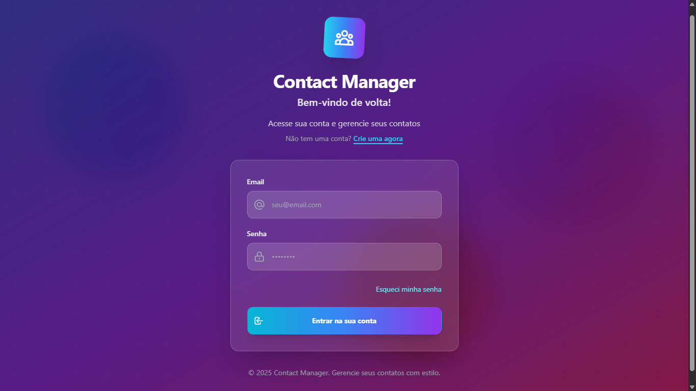
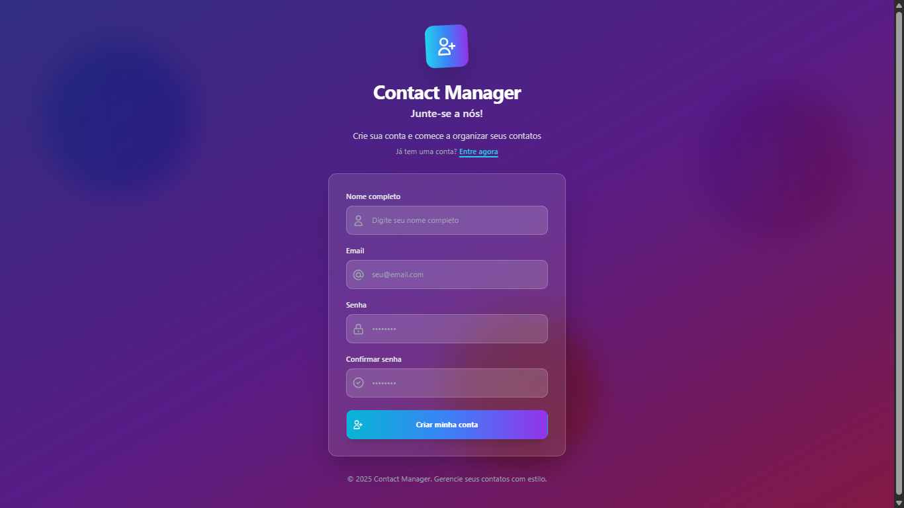
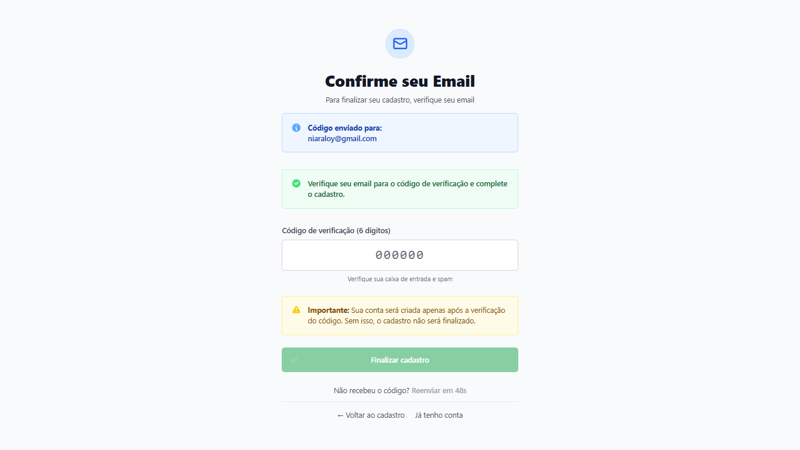
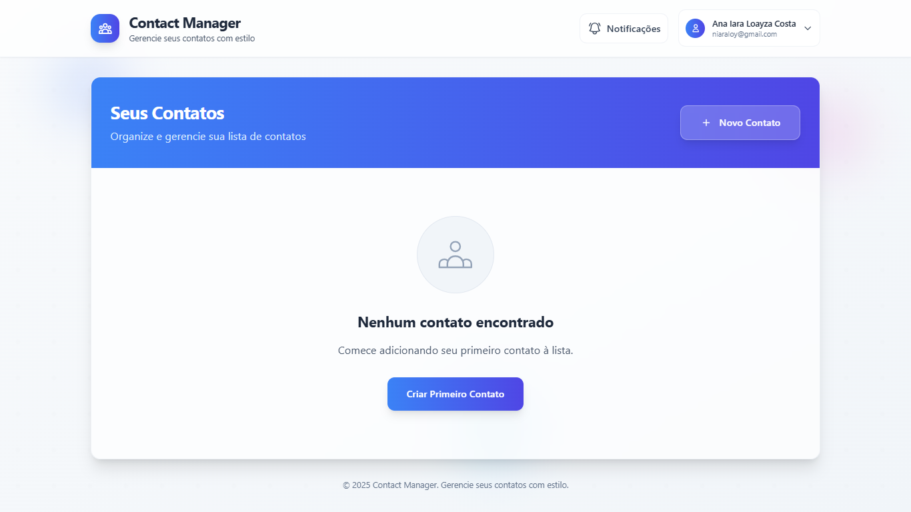
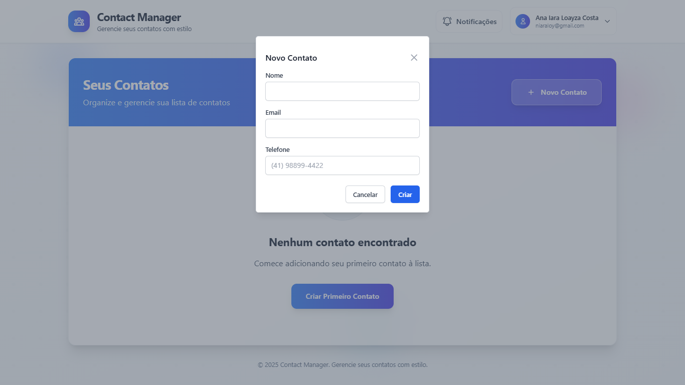
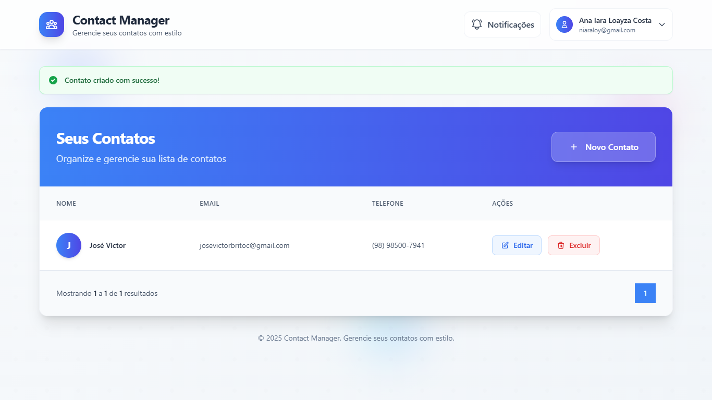
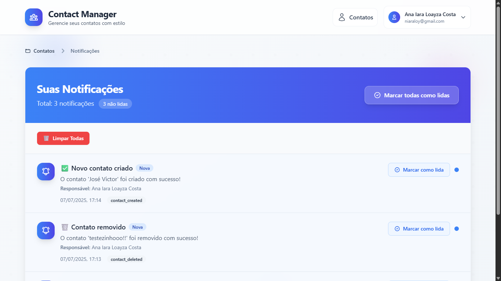
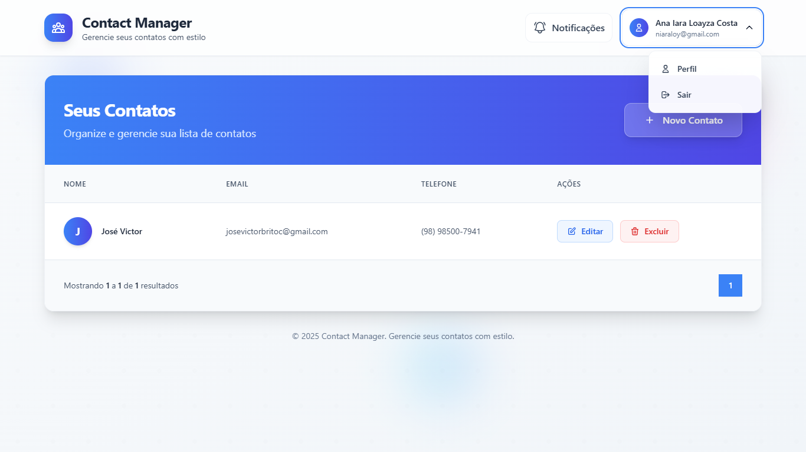
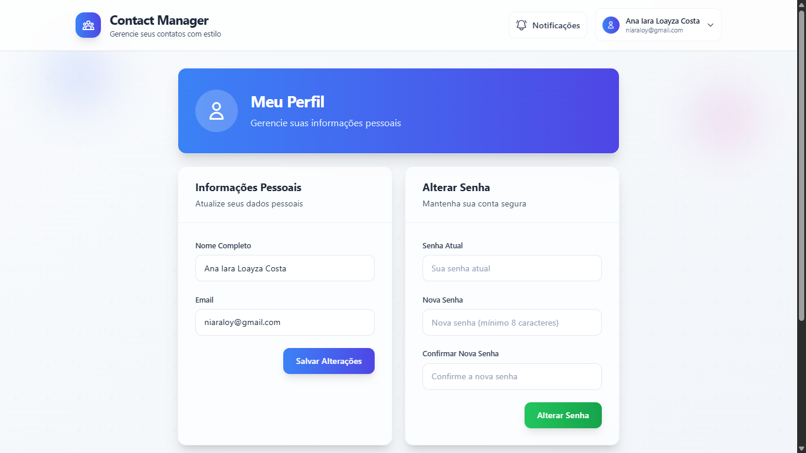

# Contact Manager

Um sistema completo de gerenciamento de contatos empresariais desenvolvido com Laravel, Vue.js e Inertia.js.

## 📋 Sobre o Projeto

O Contact Manager é uma aplicação web moderna que permite às empresas gerenciar seus contatos de forma eficiente. Desenvolvido como parte de um desafio técnico, o sistema oferece funcionalidades completas de CRUD (Create, Read, Update, Delete) para contatos, além de um sistema robusto de autenticação e notificações.

## 🚀 Funcionalidades

### 🔐 Autenticação
- **Cadastro de usuários** com confirmação via email
- **Recuperação de senha** via email
- **Logout** com limpeza de sessão

### 👥 Gerenciamento de Contatos
- **Listagem completa** de todos os contatos da empresa
- **Criação de novos contatos** com validação de dados
- **Edição de contatos existentes**
- **Exclusão de contatos** com confirmação

### 🔔 Sistema de Notificações
- **Histórico de ações** - visualize quem criou, editou ou deletou contatos
- **Notificações em tempo real** de todas as ações realizadas
- **Rastreamento de atividades** do próprio usuário e de outros usuários do sistema

### 📧 Funcionalidades de Email
- **Confirmação de registro** por email
- **Recuperação de senha** via email
- **Notificações por email** quando contatos são deletados (funcionalidade extra)

## 🛠️ Tecnologias Utilizadas

### Back-end
- **Laravel 11** - Framework PHP robusto
- **SQLite** - Banco de dados relacional (escolhido pela simplicidade e portabilidade)
- **Laravel Sanctum** - Autenticação de API
- **Laravel Mail** - Sistema de envio de emails
- **PHPUnit** - Testes de integração (Feature Tests)

### Front-end
- **Vue.js 3** - Framework JavaScript reativo
- **Inertia.js** - Bridge entre Laravel e Vue.js
- **Tailwind CSS** - Framework de estilização
- **Vite** - Build tool moderna

### Princípios e Padrões
- **SOLID** - Princípios de design de software
- **Clean Architecture** - Arquitetura limpa e organizadas
- **Service Layer** - Camada de serviços

## 📦 Instalação

### Pré-requisitos
- PHP 8.2 ou superior
- Composer
- Node.js 18 ou superior
- Git
- SQLite (já incluído no PHP)

### Passo a Passo

1. **Clone o repositório**
```bash
git clone https://github.com/iaraloayza/contact-manager-ana-iara.git
cd contact-manager-ana-iara
```

2. **Instale as dependências PHP**
```bash
composer install
```

3. **Instale as dependências Node.js**
```bash
npm install
```

4. **Configure o ambiente**
```bash
cp .env.example .env
php artisan key:generate
```

6. **Configure o email**
Edite o arquivo `.env` com suas configurações de email:
```env
MAIL_MAILER=smtp
MAIL_HOST=seu_host_smtp
MAIL_PORT=587
MAIL_USERNAME=seu_email
MAIL_PASSWORD=sua_senha
MAIL_ENCRYPTION=tls
MAIL_FROM_ADDRESS=seu_email@exemplo.com
MAIL_FROM_NAME="Contact Manager"
```

7. **Execute as migrações**
```bash
php artisan migrate
```

8. **Execute os seeders (opcional)**
```bash
php artisan db:seed
```

9. **Compile os assets**
```bash
npm run dev
```

10. **Inicie o servidor**
```bash
php artisan serve
```

A aplicação estará disponível em `http://localhost:8000`

## 🧪 Testes

Para executar os testes, utilize o comando:

```bash
php artisan test --testsuite=Feature
```

## 📱 Como Usar

### 1. Primeiro Acesso
1. Acesse `http://localhost:8000`
2. Clique em "Criar Conta"
3. Preencha os dados do formulário
4. Verifique seu email e copie o código para a tela de verificação de email

### 2. Gerenciando Contatos
1. Após o login, você será direcionado para a página de contatos
2. **Criar contato**: Clique em "Novo Contato" e preencha o formulário
3. **Editar contato**: Clique no ícone de edição ao lado do contato
4. **Deletar contato**: Clique no ícone de lixeira e confirme a ação

### 3. Visualizando Notificações
1. No menu principal, clique em "Notificações"
2. Visualize todas as ações realizadas no sistema
3. Acompanhe quem criou, editou ou deletou contatos

## 🏗️ Arquitetura

O projeto segue os princípios da Clean Architecture e SOLID:

```
app/
├── Http/
│   ├── Controllers/     # Controladores da aplicação
│   ├── Requests/        # Validações de entrada
│   └── Middleware/      # Middlewares customizados
├── Models/              # Modelos Eloquent
├── Listeners/           # Listeners que respondem aos eventos do sistema
├── Services/            # Camada de serviços
├── Notifications/       # Notificações por email
├── Providers/           # Service Providers customizados
└── Events/              # Eventos do sistema
```

## 📸 Páginas da Aplicação












## 👨‍💻 Desenvolvedor

**Ana Iara Loayza Costa**
- GitHub: [@iaraloayza](https://github.com/iaraloayza)
- LinkedIn: [Ana Iara Loayza](https://www.linkedin.com/in/ana-iara-loayza-costa-8b0886278/)

---

⭐ Espero que tenham gostado!